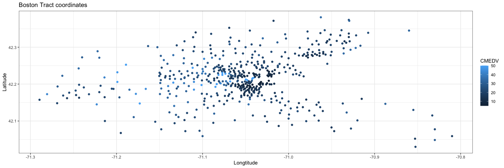

Housing Data
================

## Introduction

According to the
documentation(<https://search.r-project.org/CRAN/refmans/spData/html/boston.html>),this
dataset contains housing data that was collected as part of the 1970
census of Boston, Massachusetts.The corrected data from the Harrison and
Rubinfeld (1978) are contained in a data frame, which is comprised by
506 rows and 20 columns.Each observation (row) in the dataset contains a
collection of statistics corresponding to a single census ‘tract’ (a
small geographic region containing multiple houses, defined specifically
for a census). Some notes are that that MEDV is censored, in that median
values at or over USD 50,000 are set to USD 50,000.

In this project we will consider the spatial distribution of the CMEDV
variable. This variable corresponds to the median value (in USD 000s) of
owner-occupied housing in each census tract. Each tract is also
associated with a point location; geographic coordinates for this point
(measured in decimal degrees latitude and longitude), as well as the
town in which it is located (within the Greater Boston area), are
provided for each observation.

We are going to derive a smaller dataframe from the above data set that
contains only the variables TOWN, LON, LAT and CMEDV:

-   TOWN a factor with levels given by town names.(92 towns)
-   LON a numeric vector of tract point longitudes in decimal degrees.
-   LAT a numeric vector of tract point latitudes in decimal degrees.
-   CMEDV a numeric vector of corrected median values of owner-occupied
    housing in USD 1000.

## Analysis of data

First, we read the boston data file from spData package in R and select
the columns of interest. From the first table, shows the first rows of
the data frame, while the second table shows the number of missing
values.As we can observe, there are none and as a result we can move to
the next step.
<table>
<caption>
The first rows of the dataset, boston.c
</caption>
<thead>
<tr>
<th style="text-align:center;">
TOWN
</th>
<th style="text-align:center;">
LON
</th>
<th style="text-align:center;">
LAT
</th>
<th style="text-align:center;">
CMEDV
</th>
</tr>
</thead>
<tbody>
<tr>
<td style="text-align:center;">
Nahant
</td>
<td style="text-align:center;">
-70.96
</td>
<td style="text-align:center;">
42.26
</td>
<td style="text-align:center;">
24.0
</td>
</tr>
<tr>
<td style="text-align:center;">
Swampscott
</td>
<td style="text-align:center;">
-70.95
</td>
<td style="text-align:center;">
42.29
</td>
<td style="text-align:center;">
21.6
</td>
</tr>
<tr>
<td style="text-align:center;">
Swampscott
</td>
<td style="text-align:center;">
-70.94
</td>
<td style="text-align:center;">
42.28
</td>
<td style="text-align:center;">
34.7
</td>
</tr>
<tr>
<td style="text-align:center;">
Marblehead
</td>
<td style="text-align:center;">
-70.93
</td>
<td style="text-align:center;">
42.29
</td>
<td style="text-align:center;">
33.4
</td>
</tr>
<tr>
<td style="text-align:center;">
Marblehead
</td>
<td style="text-align:center;">
-70.92
</td>
<td style="text-align:center;">
42.30
</td>
<td style="text-align:center;">
36.2
</td>
</tr>
</tbody>
</table>
<table>
<caption>
Number of missing values
</caption>
<thead>
<tr>
<th style="text-align:left;">
</th>
<th style="text-align:center;">
x
</th>
</tr>
</thead>
<tbody>
<tr>
<td style="text-align:left;">
TOWN
</td>
<td style="text-align:center;">
0
</td>
</tr>
<tr>
<td style="text-align:left;">
LON
</td>
<td style="text-align:center;">
0
</td>
</tr>
<tr>
<td style="text-align:left;">
LAT
</td>
<td style="text-align:center;">
0
</td>
</tr>
<tr>
<td style="text-align:left;">
CMEDV
</td>
<td style="text-align:center;">
0
</td>
</tr>
</tbody>
</table>

## Visualisation

First we create a scatter plot using the coordinates of each town and
the median values of owner-occupied housing represented by color.


Next to make the visualisation process easier, we include a map. In the
figure below , we can see that the points representing the the latitudes
and longitudes, are not matching the towns on the map.We can even
observe in the second map that some towns appear to be on the water.

    ## Assuming "lon" and "lat" are longitude and latitude, respectively


    ## Assuming "lon" and "lat" are longitude and latitude, respectively


The third map shows the right and wrong coordinates for Cambridge.

    ## Assuming "LON" and "LAT" are longitude and latitude, respectively


## Coordinates correction

In order to correct the data, we suppose that all coordinates are
shifted by a certain amount. We assume that there are *n*<sub>*j*</sub>
observations in town *j*, and for each observation *k* in town *j*,we
denote the longitudinal coordinate as
*x*<sub>*j*, *k*</sub>, *k* = 1, …, *n*<sub>*j*</sub>. Then we assume:

*x*<sub>*j*, *k*</sub> = *T**C*<sub>*j*</sub><sup>(*x*)</sup> + *Δ*<sub>*j*, *k*</sub><sup>(*x*)</sup>
where *T**C*<sub>*j*</sub><sup>(*x*)</sup> is the longitudinal
coordinate of the center of town j, and
*Δ*<sub>*j*, *k*</sub><sup>(*x*)</sup> is the displacement of
observation *k* in town *j* from the town center.We also assume that the
latitudinal coordinates (which we denote *y*<sub>*j*, *k*</sub>) satisfy
a similar relationship. The suggested systematic error is therefore such
that
(*T**C*<sub>*j*</sub><sup>(*x*)</sup>,*T**C*<sub>*j*</sub><sup>(*y*)</sup>)
has been misspecified for *j* = 1, …, *n* where n is the number of
towns.

To find the displacement, we are going to use the correct center
coordinates for each town in Boston that exist in the file
BostonTownCentres.csv. First we are going to have a quick look at the
data.

Note: We can see that the towns in this instance are of type character.

    ## Rows: 92 Columns: 3

    ## ── Column specification ────────────────────────────────────────────────────────
    ## Delimiter: ","
    ## chr (1): town
    ## dbl (2): lat, lon

    ## 
    ## ℹ Use `spec()` to retrieve the full column specification for this data.
    ## ℹ Specify the column types or set `show_col_types = FALSE` to quiet this message.

<table>
<caption>
Correct coordinates for each town in Boston
</caption>
<thead>
<tr>
<th style="text-align:center;">
town
</th>
<th style="text-align:center;">
lat
</th>
<th style="text-align:center;">
lon
</th>
</tr>
</thead>
<tbody>
<tr>
<td style="text-align:center;">
Arlington
</td>
<td style="text-align:center;">
42.41537
</td>
<td style="text-align:center;">
-71.15644
</td>
</tr>
<tr>
<td style="text-align:center;">
Ashland
</td>
<td style="text-align:center;">
42.26066
</td>
<td style="text-align:center;">
-71.46413
</td>
</tr>
<tr>
<td style="text-align:center;">
Bedford
</td>
<td style="text-align:center;">
42.49173
</td>
<td style="text-align:center;">
-71.28179
</td>
</tr>
<tr>
<td style="text-align:center;">
Belmont
</td>
<td style="text-align:center;">
42.39593
</td>
<td style="text-align:center;">
-71.17867
</td>
</tr>
<tr>
<td style="text-align:center;">
Beverly
</td>
<td style="text-align:center;">
42.55843
</td>
<td style="text-align:center;">
-70.88005
</td>
</tr>
</tbody>
</table>

Next we’re using an appropriate mutating join to combine the two data
sets.We check and observe that the number of columns in `boston.c`
doesn’t match the number of columns in the new data frame.We find that
the missing data corresponds to Saugus, which is spelled as Sargus in
boston.c. As a result, we correct the instances of Sargus and join the
corrected data frame with BostonTownCentres.This time the column match.

``` r
#Join data frames
join.coord<-centre.coord %>% left_join(BostonData, by=c('town'='TOWN'))
#Check number of rows match
nrow(join.coord)==nrow(BostonData)
```

    ## [1] FALSE

``` r
##Find the town that's missing
setdiff(unique(BostonData$TOWN), unique(join.coord$town))
```

    ## [1] "Sargus"

``` r
#Empty dataframe to avoid duplicates
join.coord<-NA
##Correct missing values
BostonData$TOWN[BostonData$TOWN=='Sargus']<-'Saugus'
#Join correct data frames
join.coord<-centre.coord %>% left_join(BostonData, by=c('town'='TOWN'))
nrow(join.coord)==nrow(BostonData)
```

    ## [1] TRUE

Next we’re going to visualize the correct coordinates.We can already
observe that there are no points on water and they seem to match the
towns on the map.

    ## Assuming "lon" and "lat" are longitude and latitude, respectively


We’re going to zoom into an area to check if everything is in order.

    ## Assuming "lon" and "lat" are longitude and latitude, respectively


### Correct coordinates

In order to fix our data set, we need replace the centroid for each town
(i.e. for *j* = 1, …, *n*) of the *n*<sub>*j*</sub> boston.c locations
with the true town center. First, we are going to find the centroid in
our dataset by grouping the data by town and finding the mean longitude
and latitude. Then we calculate the displacement as so:
*x*<sub>*j*, *k*</sub> = *T**C*<sub>*j*</sub><sup>(*x*)</sup> + *Δ*<sub>*j*, *k*</sub><sup>(*x*)</sup> ⇒ *Δ*<sub>*j*, *k*</sub><sup>(*x*)</sup> = *x*<sub>*j*, *k*</sub> − *T**C*<sub>*j*</sub><sup>(*x*)</sup>
In the equation above, *x*<sub>*j*, *k*</sub> is known and is equal to
the coordinates in boston.c and *T**C*<sub>*j*</sub><sup>(*x*)</sup> was
calculated above as the mean lon and lat. After, we add the displacement
of each town to the centroids contained in BostonTownCentres.csv and
create a new dataframe containing two columns with the true coordinates
for each observation. Hence we add to the above combined dataframe.

``` r
#Calculate the centroid in old data set
centroid<-BostonData %>% group_by(TOWN) %>% summarise(centre_lon=mean(LON),centre_lat=mean(LAT))
#data frame for correct lon-lat
new_cord<-data.frame(cor_lon=as.double(),cor_lat=as.double) 

##Loop through all names in centroid
for (name in centroid$TOWN){
  #Create a temporary data frame from our data containing the lon and lats of the town equal to name
 temp<-BostonData %>% filter(TOWN==name)
  #Create temporary data frames containing the wrong and correct cenrtoids of the town equal to name
  temp.centre<-centroid %>% filter(TOWN==name)
  cor.centroid<-centre.coord %>% filter(town==name)
  #Calculate displacement for both lon-lat 
  dislon<-temp$LON-temp.centre$centre_lon
  dislat<-temp$LAT-temp.centre$centre_lat
  #Calculate the right coordinates
  cor_lon<-cor.centroid$lon+dislon
  cor_lat<-dislat+cor.centroid$lat
  #Add the right coordinates to our new dataframe 
  new_cord<-rbind(new_cord, cbind(cor_lon,cor_lat))
}

#Combine the new data frame 
join.coord<-cbind(join.coord,new_cord)
```


### Visualisation

Finally, we construct a visualisation that shows the spatial
distribution of the median value of owner-occupied housing in Greater
Boston in 1970. In this instance, we are going to use ggmap.We observe
that for some towns have only one observation so we can’t create
polygons.

    ## Source : https://maps.googleapis.com/maps/api/staticmap?center=42.36008,-71.05888&zoom=10&size=640x640&scale=2&maptype=terrain&key=xxx-0NQyKizPR9jdAYCfTiyB5IhVfbdU2xI


